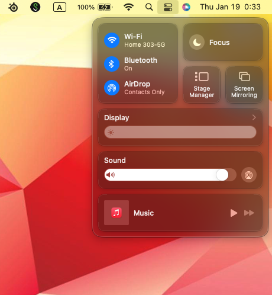
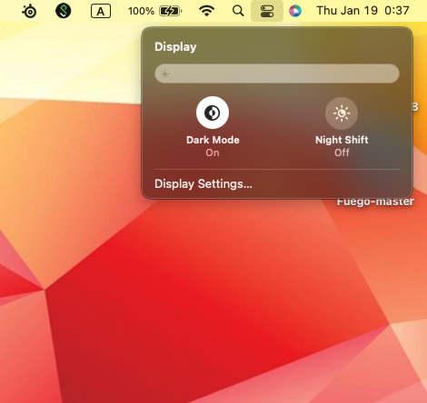
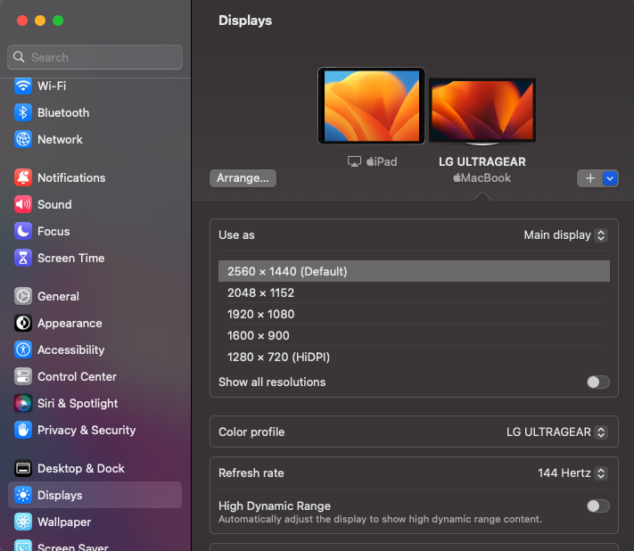
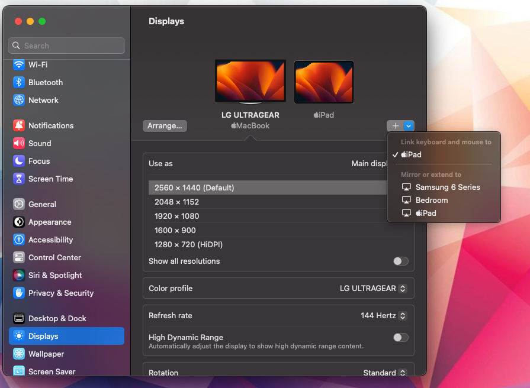

# Introduction
Have you ever encounter times when one MacBook screen was just not enough for the amount of windows you are running? Have you ever wished you had a portable monitor? 

## Requirements
- A Mac running macOS
- iPad
- Both devices have to be signed into the same Apple ID using two-factor authentication
- Both devices must be 30 feet (10 meters) of eath other and have Bluetooth, Wi-Fi, and Handoff turned on 
	* **Note** : Connected wirelessly
- To use Sidecar over USB, your iPad must be set to trust your Mac

## System Requirements

### macOS Catalina or Later
- MacBook Pro (2016 or later)
- MacBook (2016 or later)
- MacBook Air (2018 or later)
- iMac (2017 or Retina 5K, 27-inch, Late 2015)
- iMac Pro
- Mac Mini (2018 or later
- Mac Pro (2019)
- Mac Studio

-
### iPadOS 13 or Later
- iPad Pro (all models)
- iPad (6th generation or later)
- iPad Mini (5th generation or later)
- iPad Air (3rd generation or later)

## Steps
#### Step 1 : Locate The Control Center
- Click on the control center in the upper right hand corner

-
#### Step 2 : Select Display
- Once the control center pops up, select Display

  
-
#### Step 3 : Enter the Display Settings
- Click on "Display Settings..."

-
#### Step 4 : Connecting MacBook to iPad
- Once in Display Settings, locate the "+" drop down menu

-
- In the drop down menu, select your iPad that you would like to extend or mirror to

#### Step 5 : Enjoy your portable monitor/iPad

